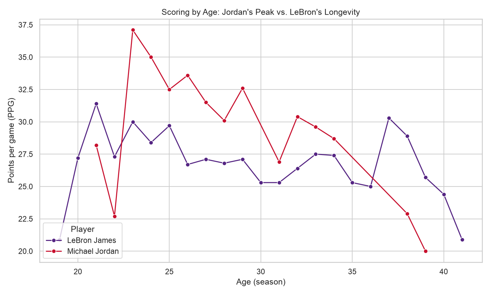
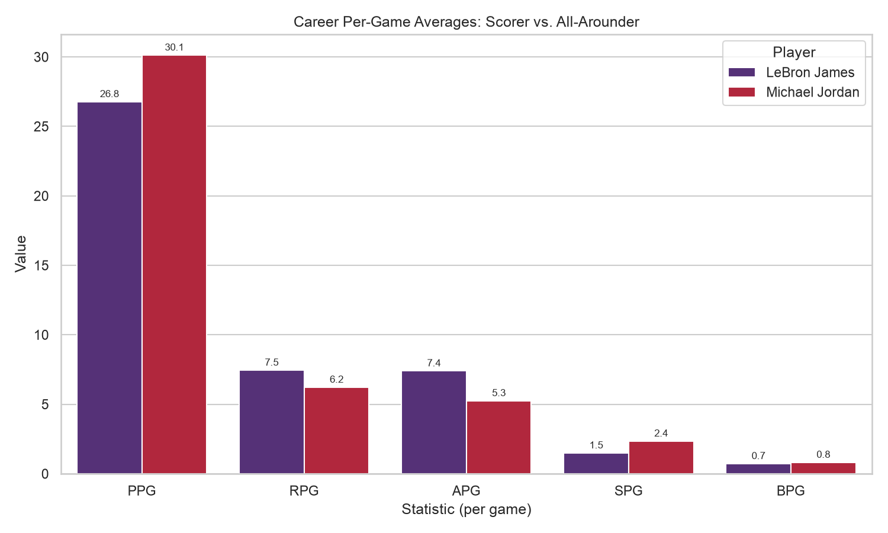
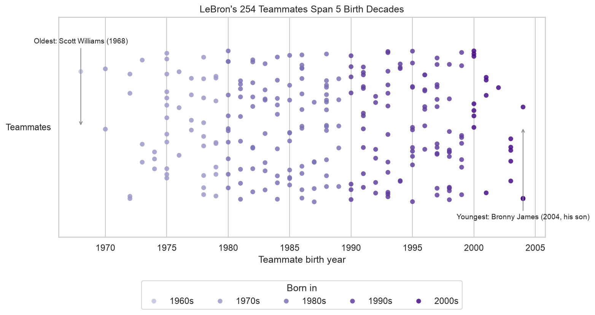
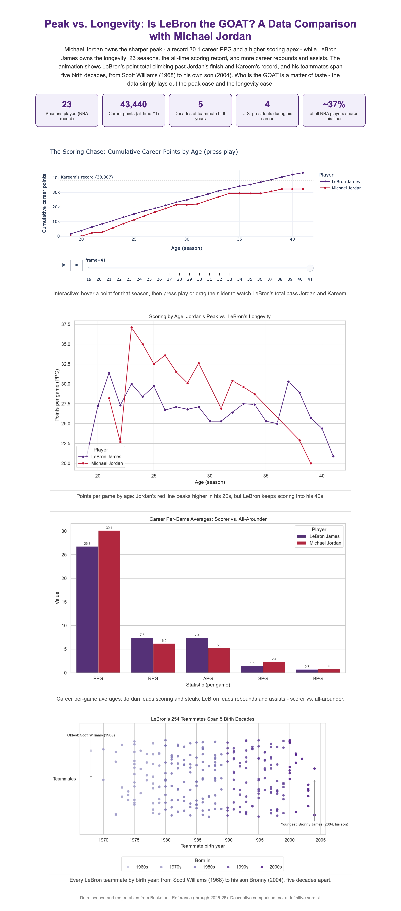

# Peak vs. Longevity: Is LeBron the GOAT? A Data Comparison with Michael Jordan

- **Name:** Ryan Gogerty
- **JHED:** rgogerty
- **Course:** EN.605.256 — Modern Software Concepts in Python
- **Assignment:** Module 10 — Data Dashboard

## Research question & dataset

**Leading question:** *Peak vs. Longevity — is LeBron James the GOAT? A data
comparison with Michael Jordan.* The "greatest of all time" debate usually pits
Jordan's dominance against LeBron's staying power, so I break the question into
sub-questions: whose scoring **peak** was higher, who is the better **all-around**
player, how does the **all-time scoring** chase actually unfold, and just how
**outrageous** is LeBron's longevity?

**Dataset:** season-by-season and team-roster tables from the public
**[Basketball-Reference](https://www.basketball-reference.com)** database
(`players/j/jamesle01.html`, `players/j/jordami01.html`, and each LeBron
team-season roster page). These are committed here as three CSV snapshots
(`lebron_seasons.csv`, `jordan_seasons.csv`, `lebron_teammates.csv`) so the
dashboard runs with no live network calls. The source fits the question because
it carries every player-season (points, age, per-game stats) plus roster
birthdates — exactly what a peak-vs-longevity comparison needs. *(NBA is a
custom topic outside the four suggested datasets, so this question + source was
submitted to the instructors for approval per the brief.)*

## How to run

```bash
cd module_10
python3.12 -m venv .venv          # Python 3.10+ required; developed on 3.12
source .venv/bin/activate
pip install -r requirements.txt
python visualization.py           # writes the 3 PNGs + scoring_chase.html
python dashboard.py               # serves the dashboard at http://127.0.0.1:8050
```

`visualization.py` reads the committed CSV snapshots and prints a console
summary of every headline number used below, so nothing in this README is
hand-typed.

## Dependencies

See `requirements.txt`: `pandas`, `numpy`, `matplotlib`, `seaborn`, `plotly`,
`dash` (Python 3.10+).

## Exploratory data analysis

`visualization.py` loads each cleaned season table (dropping Jordan's four "Did
Not Play" retirement rows), sorts by age, and computes **cumulative career
points** and **games-weighted career per-game averages**. LeBron's 254 unique
teammates are assembled from 23 team-season rosters, de-duplicated, and bucketed
by **birth decade**. The cleaned data gives LeBron **43,440 points over 23
seasons (26.8 PPG)** versus Jordan's **32,292 points over 15 seasons (30.1
PPG)** — the numbers the visualizations build on.

## Visualizations

### 1. Scoring by age (Seaborn)



Jordan's red line peaks far higher — up to **37.1 PPG at age 23** — and stays in
the low 30s through his 20s, the sharper prime. LeBron's purple line is lower at
its peak (**31.4**) but extends all the way to **age 41**, years after Jordan's
line ends at 39. This is the visual heart of "peak vs. longevity."

### 2. Career per-game averages (Seaborn)



Jordan leads the pure-scoring categories — **PPG (30.1 vs 26.8)** and **steals
(2.4 vs 1.5)** — while LeBron leads **rebounds (7.5 vs 6.2)** and **assists (7.4
vs 5.3)**. The fingerprint frames the debate as *scorer vs. all-arounder* rather
than one player being better at everything.

### 3. LeBron's teammates span five birth decades (Seaborn)



Each dot is one of LeBron's **254 career teammates**, placed by birth year and
shaded light-to-dark by decade. They span **five decades**, from **Scott
Williams (born 1968)** on the 2004-05 Cavaliers to **Bronny James (born 2004)** —
his own son, and the first father-son duo in NBA history. Few careers are long
enough to touch that many basketball generations.

### 4. The scoring chase (Plotly — interactive & animated)

Saved as **`scoring_chase.html`** (open in a browser) and embedded live in the
dashboard. Each player's **cumulative career points** grow by age as the
animation plays; a dashed reference line marks **Kareem Abdul-Jabbar's 38,387**,
the record LeBron passed on Feb 7, 2023. Jordan's line plateaus at 32,292 while
LeBron's keeps climbing to 43,440 — accumulation as its own kind of greatness.

## Dashboard

`dashboard.py` is a single-page Dash app: the research question as its title,
three sentences of guiding text, a row of fun-fact tiles (23 seasons · all-time
scoring leader · teammates across 5 decades · 4 U.S. presidents · ~37% of all
NBA players), the live animated scoring chase, and the three Seaborn charts. A
screenshot of the running app is saved as `dashboard.png`:



## Conclusion

The data reframes the GOAT debate instead of settling it. **Jordan owns the
peak** — a higher scoring apex, the record 30.1 career PPG, and greater
per-game efficiency in his prime. **LeBron owns longevity and accumulation** —
the all-time scoring record, 23 seasons, more career rebounds and assists, and a
teammate list spanning five birth decades. Which matters more is a value
judgment, not a statistic, so this dashboard deliberately presents both cases
rather than declaring a winner; the figures are descriptive comparisons, not a
causal or definitive verdict.

## Outputs

| File | Contents |
| --- | --- |
| `visualization.py` | All plot + EDA code (pylint 10/10). |
| `dashboard.py` | Single-page Dash application (pylint 10/10). |
| `lebron_seasons.csv`, `jordan_seasons.csv` | Committed season snapshots. |
| `lebron_teammates.csv` | Committed teammate + birth-year snapshot. |
| `scoring_by_age.png` | Seaborn line — PPG by age. |
| `career_fingerprint.png` | Seaborn grouped bar — career per-game averages. |
| `teammate_birth_span.png` | Seaborn strip plot — teammates across five decades. |
| `scoring_chase.html` | Interactive, animated Plotly cumulative-points race. |
| `dashboard.png` | Screenshot of the running dashboard. |
| `requirements.txt` | Visualization/dashboard environment. |
