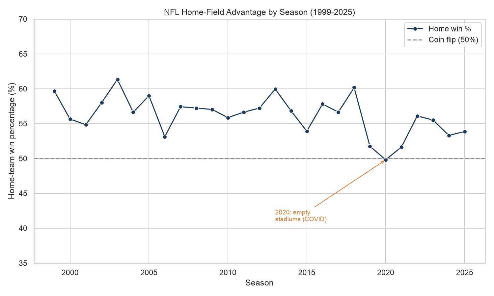
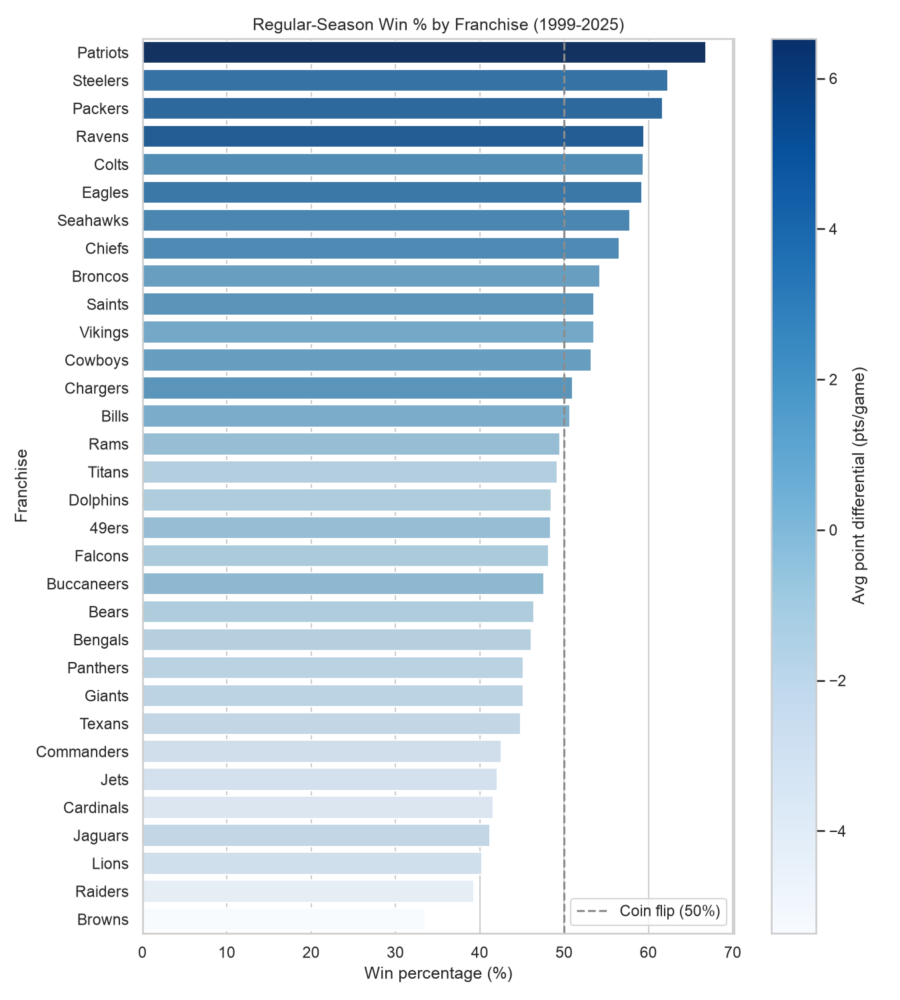
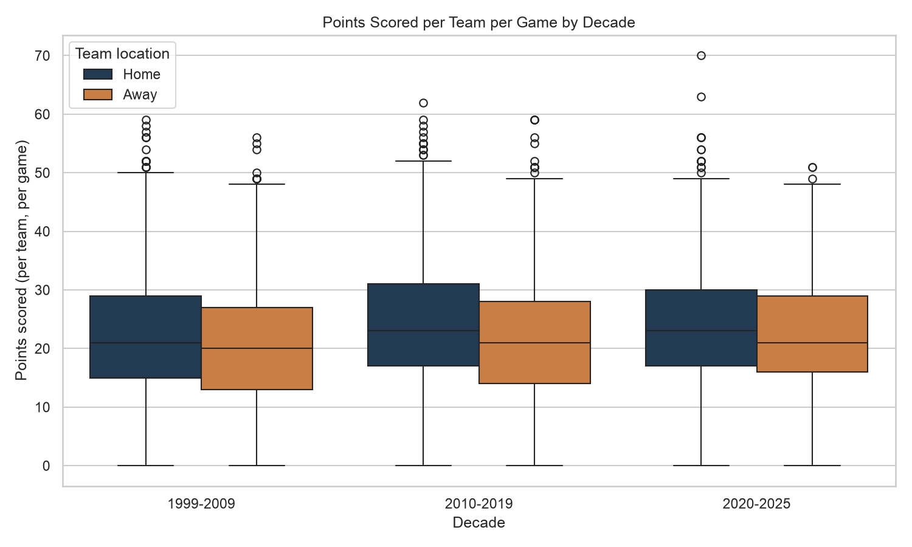

# What Gives an NFL Team the Edge — and How Has the Game Changed Since 1999?

- **Name:** Ryan Gogerty
- **JHED:** rgogerty
- **Course:** EN.605.256 — Modern Software Concepts in Python
- **Assignment:** Module 10 — Data Dashboard

## Research question & dataset

**Leading question:** *What gives an NFL team the edge — and how has the game
changed since 1999?* I break this into four sub-questions: does playing at home
still matter (and what happened in the fan-less 2020 season)? which franchises
win most? has scoring risen into an "offense era"? and are the best teams built
on offense, defense, or both?

**Dataset:** the open-source **nflverse "games"** table
([`nflverse/nfldata/data/games.csv`](https://raw.githubusercontent.com/nflverse/nfldata/master/data/games.csv)) —
one row per NFL game from **1999–2025** with the final score, home/away teams,
venue, and betting lines. It is a public, no-login CSV, so it is fully
reproducible; a snapshot is committed here as `nfl_games.csv`. It fits the
question because a single file already carries scores, teams, and season/venue
context, so team-, franchise-, and era-level statistics need no external joins.
*(NFL is a custom topic outside the four suggested datasets, so this
question + source was submitted to the instructors for approval per the brief.)*

## How to run

```bash
cd module_10
python3.12 -m venv .venv          # Python 3.10+ required; developed on 3.12
source .venv/bin/activate
pip install -r requirements.txt
python visualization.py           # writes the 3 PNGs + offense_vs_defense.html
python dashboard.py               # serves the dashboard at http://127.0.0.1:8050
```

`visualization.py` reads the bundled `nfl_games.csv` (or downloads it once from
nflverse if the file is missing) and prints a short console summary of the
headline numbers used below, so nothing in this README is hand-typed.

## Dependencies

See `requirements.txt`: `pandas`, `numpy`, `matplotlib`, `seaborn`, `plotly`,
`dash` (Python 3.10+).

## Exploratory data analysis

`visualization.py` runs the full pipeline: load the raw table; **drop the 272
unplayed 2026 games** and coerce scores to numbers; **fold relocated franchises**
into their current code (OAK→LV, SD→LAC, STL→LA) so each franchise is one entity;
**reshape** every game into a one-row-per-team-per-game frame (each game yields a
home row and an away row, with ties scored as half-wins); and restrict rate
statistics to the **regular season** so win percentages are not skewed by uneven
playoff appearances. This leaves **7,276 games** and **13,934 regular-season
team-games** to aggregate by season, franchise, and decade.

## Visualizations

### 1. Home-field advantage by season (Seaborn)



Home teams win about **56% of regular-season games on average**, and every
season from 1999–2019 sits above the 50% coin-flip line. The one clear
exception is **2020 (49.8%)** — the COVID season played in empty or near-empty
stadiums — when the home edge briefly disappeared before rebounding. This is
consistent with (but not proof of) crowds contributing to home-field advantage.

### 2. Regular-season win % by franchise (Seaborn)



The **Patriots** top the era at **66.8%**, trailed by the Steelers, Packers, and
Ravens, while the Browns anchor the bottom. Bars are shaded by each franchise's
**average point differential**: the darkest (winningest) teams are exactly those
that outscore opponents by the most per game, so sustained scoring margin — not
luck — separates the consistent winners.

### 3. Points scored per team per game by decade (Seaborn)



Median per-team scoring drifts upward across the three decades, and average
**combined** points per game rise from **42.2 (1999–2009) to 45.7 (2020–2025)** —
the modern offense-friendly era. In every decade the **home** boxes sit slightly
above the **away** boxes, a second, distributional view of the home edge from
chart 1.

### 4. Team offense vs. defense by season (Plotly — interactive & animated)

Saved as **`offense_vs_defense.html`** (open it in any browser) and embedded live
in the dashboard. Each dot is one team-season: **x = points scored per game**,
**y = points allowed per game**, **colour = win %**, **size = games played**, and
the **slider/play button animates through 1999–2025**. Dotted lines mark the
league averages, splitting the field into quadrants; elite teams settle in the
**lower-right** (score a lot, allow little) and drift toward dark, high-win-%
colours — visually tying offense *and* defense back to winning.

## Dashboard

`dashboard.py` is a single-page Dash app whose title is the research question,
with three sentences of guiding text and all four figures (the live Plotly chart
plus the three PNGs). A screenshot of the running app is saved as
`dashboard.png`:


## Conclusion

The evidence points to one answer: **a team's edge comes mostly from a sustained
scoring margin.** Win percentage tracks point differential almost perfectly
across franchises (chart 2), and the offense-vs-defense view (chart 4) shows the
best teams both scoring above and conceding below league average. **Home field is
a real but smaller and more fragile edge** — worth roughly six points of win rate
on average, yet it evaporated in the fan-less 2020 season (chart 1). Meanwhile
the league has shifted modestly toward offense over 25 years (chart 3). These are
**observational associations, not causal claims** — the 2020 dip in particular is
confounded by pandemic travel and protocols, not just empty seats — but together
they consistently favor teams that win the scoring-margin battle.

## Outputs

| File | Contents |
| --- | --- |
| `visualization.py` | All plot-generation + EDA code (pylint 10/10). |
| `dashboard.py` | Single-page Dash application (pylint 10/10). |
| `nfl_games.csv` | Committed snapshot of the nflverse games dataset. |
| `home_advantage_by_season.png` | Seaborn line chart — home win % by season. |
| `team_win_pct.png` | Seaborn bar chart — franchise win %, shaded by point diff. |
| `points_per_game_by_decade.png` | Seaborn box plot — scoring by decade, home vs away. |
| `offense_vs_defense.html` | Interactive, animated Plotly scatter (offense vs defense). |
| `dashboard.png` | Screenshot of the running dashboard. |
| `requirements.txt` | Visualization/dashboard environment. |
