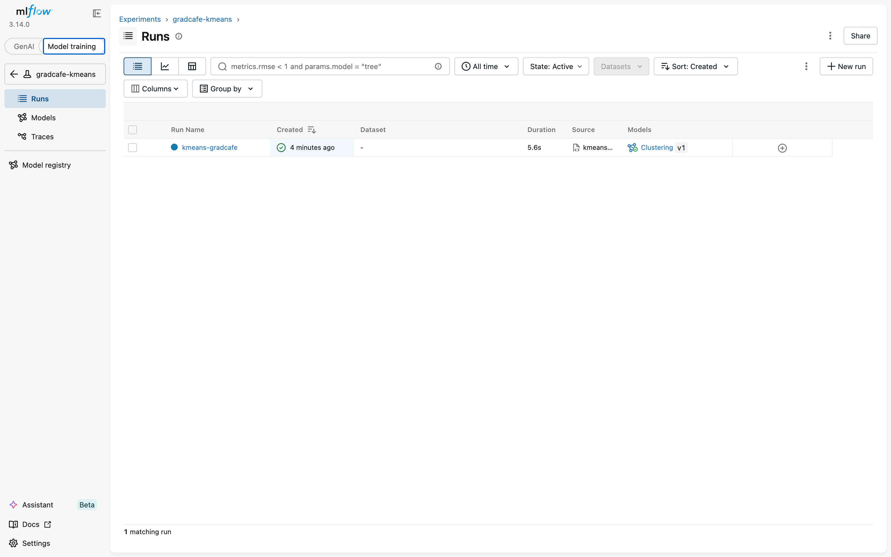
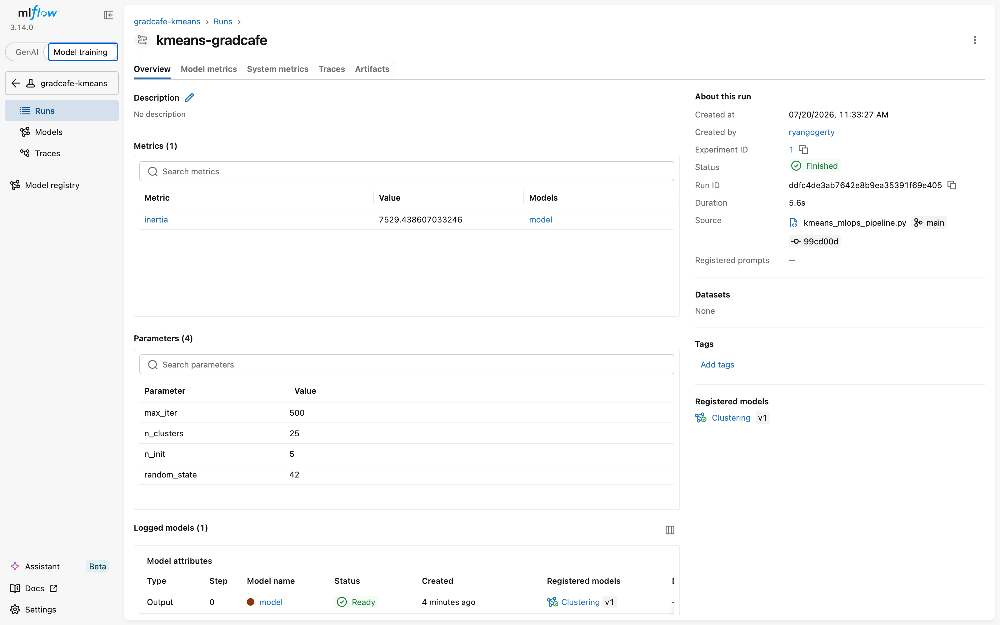
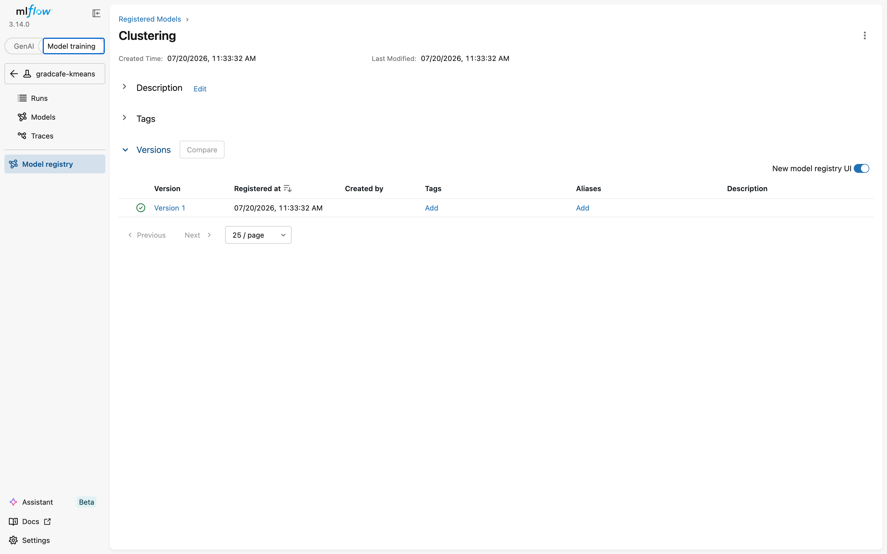
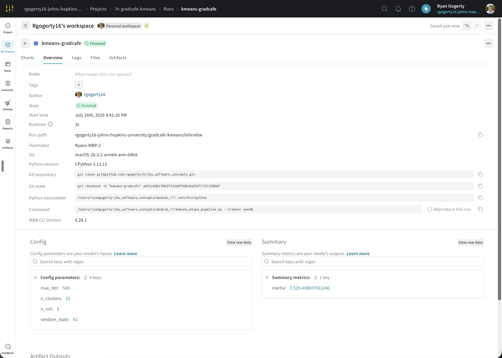
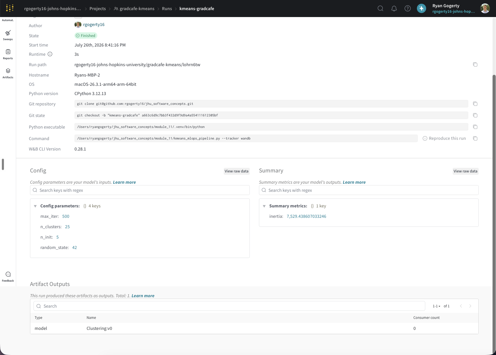
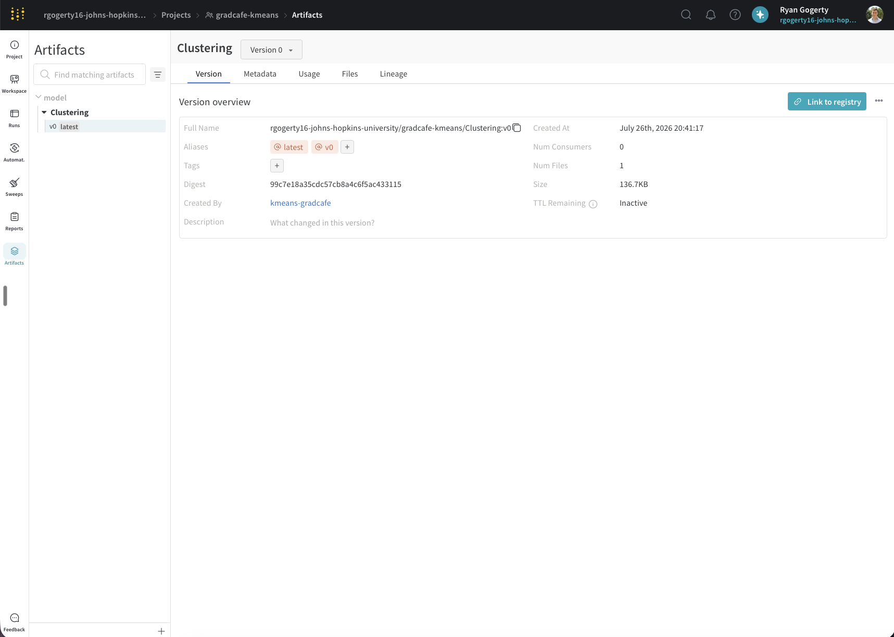

# Module 11 — MLOps: MLflow Tracking for the Grad Café KMeans Model

- **Name:** Ryan Gogerty
- **JHED:** rgogerty
- **Course:** EN.605.256 — Modern Software Concepts in Python
- **Assignment:** Module 11 — MLOps Pipeline

## Purpose

`kmeans_mlops_pipeline.py` takes the Module 9 clustering workflow — TF-IDF of Grad
Café **program names** → **PCA** → **KMeans** — and wraps a single training run in
**experiment tracking**. It logs the required clustering parameters, the model's
`inertia_` metric, and the trained model itself to an experiment-tracking backend,
so runs are reproducible and auditable. The backend is selectable with a
`--tracker` flag: **MLflow** (default) or **Weights & Biases** (extra credit).

## Setup and run

```bash
cd module_11
python3.12 -m venv .venv                 # Python 3.10+ required; developed on 3.12
source .venv/bin/activate
pip install -r requirements.txt
```

**1. Start the MLflow tracking server** (localhost, port 8080). The Model Registry
needs a database-backed store, so use a SQLite backend:

```bash
mlflow server --host 127.0.0.1 --port 8080 --backend-store-uri sqlite:///mlflow.db
```

The UI is then reachable at <http://127.0.0.1:8080>. (If you are on a remote host,
replace `127.0.0.1` with the machine IP from `hostname -I`; the code's tracking URI
must match.)

**2. Run the pipeline** (in a second terminal, with the venv active):

```bash
python kmeans_mlops_pipeline.py                  # tracks to MLflow (default)
python kmeans_mlops_pipeline.py --tracker wandb  # tracks to Weights & Biases
```

The script sets the tracking URI in code with
`mlflow.set_tracking_uri("http://127.0.0.1:8080")`, so no extra configuration is
needed once the server is up.

## What is logged

- **Parameters** (passed directly into the trained `KMeans`):
  `max_iter=500`, `n_clusters=25`, `n_init=5`, `random_state=42`.
- **Metric:** the fitted model's `inertia_` (this run: **≈ 7529.44** over 29,992
  cleaned program names, TF-IDF `(29992, 1000)` → PCA `80` components).
- **Model:** the trained `KMeans` estimator, logged and **registered as
  `Clustering`** (Version 1) under the experiment **`gradcafe-kmeans`**, run
  **`kmeans-gradcafe`**.

## Where to find things

- **Run & metrics:** MLflow UI → *Model training* → experiment `gradcafe-kmeans` →
  run `kmeans-gradcafe`.
- **Registered model:** MLflow UI → *Model registry* → `Clustering` → Version 1
  (reloadable via `mlflow.sklearn.load_model("models:/Clustering/1")`).
- **Screenshots** (in this folder):

| File | Shows |
| --- | --- |
| `cluster_run.png` | The successful run in the MLflow runs table. |
| `cluster_details.png` | The logged parameters and the `inertia` metric. |
| `model_details.png` | The registered `Clustering` model (Version 1). |





## Data

`applicant_data.json` (committed here) is the same 30,000-record Grad Café dataset
used in Module 9. `load_programs` reproduces the Module 9 cleaning (drop blank
programs, rebuild `"program, university"`, split on the first comma, collapse
whitespace) before vectorising the program names.

## Extra credit — Weights & Biases (wandb)

The same script logs to wandb when run with `--tracker wandb`. One-time setup:

```bash
pip install -r requirements.txt   # wandb is already included
wandb login                       # paste your API key from https://wandb.ai/authorize
python kmeans_mlops_pipeline.py --tracker wandb
```

The wandb run logs the same clustering `config` (params), the `inertia` metric, and
the trained model saved as a **wandb Artifact** named `Clustering`. Evidence:

| File | Shows |
| --- | --- |
| `wandb_run.png` | The successful wandb run. |
| `wandb_details.png` | The logged config parameters and the tracked `inertia`. |
| `wandb_artifact.png` | The saved model artifact. |





## Notes

- Runtime artifacts (`mlflow.db`, `mlruns/`, `mlartifacts/`, `wandb/`, `*.joblib`)
  are git-ignored; they regenerate on each run.
- All code is a single file, `kmeans_mlops_pipeline.py`, and lints **10.00/10** with
  the bundled `.pylintrc` (`pylint --rcfile=.pylintrc kmeans_mlops_pipeline.py`).
