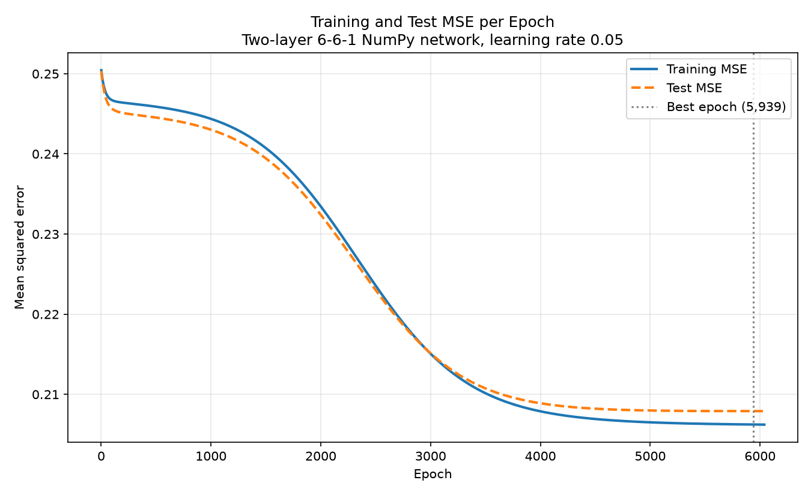

# Module 12 Write-Up: A Two-Layer Neural Network for Admissions Prediction

**Name:** Ryan Gogerty
**Course:** EN.605.256, Modern Software Concepts in Python
**Assignment:** Module 12, Neural Networks

## 1. What was built

`neural_network.py` trains a fully connected 6-6-1 neural network, written
with NumPy only, to predict whether a graduate-school applicant was Accepted or
Rejected. scikit-learn is used for exactly one thing, `train_test_split`; the
forward pass, the backward pass, the loss, and the training loop are all hand
written. The data is the Grad Cafe corpus collected in Module 2 (30,000 posted
admissions results).

Fixed configuration, exactly as specified:

| Setting | Value |
| --- | --- |
| RANDOM_SEED | 42 |
| HIDDEN_UNITS | 6 |
| LEARNING_RATE | 0.05 |
| MAX_EPOCHS | 10000 |
| PATIENCE | 100 |
| test_size / random_state / shuffle | 0.2 / 42 / True |
| Weight init | normal, mean 0, std 0.1 |
| Bias init | 0 |
| Activation | sigmoid after the hidden layer and after the output layer |
| Loss | mean squared error |

### Preprocessing

Rows survive only if `applicant_status` is Accepted or Rejected and
`masters_or_phd` is Masters or PhD. `gpa`, `gre`, `gre_v`, and `gre_aw` are
converted to floats; `ms_vs_phd` encodes PhD = 1 / Masters = 0;
`international_vs_local` encodes International = 1 / Local or American = 0; and
`target` encodes Accepted = 1 / Rejected = 0.

Filtering left **24,326 of 30,000 rows** (10,687 Accepted and 13,639 Rejected),
split into **19,460 training** and **4,866 test** rows.

Every statistic used for filling and scaling was computed on the training split
alone. That ordering matters: if medians, means, and standard deviations were
taken over the whole dataset, information from the test rows would have shaped
the numbers used to prepare the training rows, and the reported test score would
be optimistic. Fitting on the training split alone keeps the test set an honest
stand-in for applicants the model has never seen.

Training-set statistics:

```
feature                       median        mean         std
gpa                           3.8500      3.8134      0.3085
gre                         316.0000    311.1799     28.8447
gre_v                       161.0000    160.9873      1.9706
gre_aw                        4.5000      4.7809      5.2542
ms_vs_phd                     1.0000      0.7219      0.4481
international_vs_local        0.0000      0.4706      0.4991
```

### Network shapes

`w1` is (6, 6), one weight per (input feature, hidden unit) pair. `b1` is
(1, 6), one bias per hidden unit. `w2` is (6, 1), one weight per (hidden unit,
output unit). `b2` is (1, 1). Forty-nine parameters in total.

The hidden layer computes `a1 = sigmoid(x @ w1 + b1)`: six different non-linear
blends of the six standardized inputs, which is what allows the network to
represent interactions a single linear layer could not. The output layer
computes `a2 = sigmoid(a1 @ w2 + b2)`, one weighted summary of those blends
squashed back into (0, 1). Because `a2` is bounded, rises with the evidence for
acceptance, and is trained against 0/1 targets, it reads as a probability-like
score. MSE training leaves it uncalibrated, though, so it is not a literal
admission probability.

## 2. Training printouts

Full-batch gradient descent, printing every 100 epochs. This is the complete
progress log; the unabridged run transcript, including every section's output,
is in `training.log`.

```
   epoch     train MSE      test MSE   test accuracy
----------------------------------------------------
       1      0.250439      0.250319          0.3761
     100      0.246696      0.245628          0.5697
     200      0.246390      0.245102          0.5697
     300      0.246233      0.244895          0.5697
     400      0.246070      0.244720          0.5697
     500      0.245888      0.244533          0.5697
     600      0.245678      0.244321          0.5697
     700      0.245433      0.244074          0.5697
     800      0.245141      0.243782          0.5697
     900      0.244791      0.243434          0.5697
   1,000      0.244372      0.243018          0.5697
   1,100      0.243869      0.242521          0.5697
   1,200      0.243268      0.241929          0.5697
   1,300      0.242553      0.241228          0.5697
   1,400      0.241709      0.240402          0.5697
   1,500      0.240722      0.239440          0.5697
   1,600      0.239581      0.238330          0.5697
   1,700      0.238280      0.237068          0.5701
   1,800      0.236817      0.235654          0.5703
   1,900      0.235200      0.234094          0.5703
   2,000      0.233442      0.232403          0.5746
   2,100      0.231567      0.230605          0.6681
   2,200      0.229605      0.228730          0.7049
   2,300      0.227590      0.226812          0.7049
   2,400      0.225563      0.224890          0.7047
   2,500      0.223563      0.223001          0.7047
   2,600      0.221626      0.221182          0.7043
   2,700      0.219786      0.219464          0.7043
   2,800      0.218068      0.217870          0.7043
   2,900      0.216490      0.216418          0.7043
   3,000      0.215064      0.215115          0.7043
   3,100      0.213793      0.213965          0.7043
   3,200      0.212674      0.212962          0.7043
   3,300      0.211700      0.212098          0.7043
   3,400      0.210859      0.211362          0.7043
   3,500      0.210138      0.210740          0.7043
   3,600      0.209524      0.210219          0.7043
   3,700      0.209004      0.209785          0.7043
   3,800      0.208564      0.209426          0.7043
   3,900      0.208193      0.209131          0.7043
   4,000      0.207881      0.208889          0.7043
   4,500      0.206923      0.208209          0.7043
   5,000      0.206509      0.207983          0.7043
   5,500      0.206320      0.207918          0.7043
   5,900      0.206241      0.207909          0.7043
   6,000      0.206227      0.207909          0.7043
   6,039      0.206222      0.207909          0.7043

Early stopping at epoch 6,039: test MSE has not improved for 100
consecutive epochs.
Restored the parameters from epoch 5,939 (test MSE 0.207908).
```

(Rows for epochs 4,100 through 4,400, 4,600 through 4,900, 5,100 through 5,400,
and 5,600 through 5,800 are omitted here only to keep the table readable. They
appear in full in `training.log` and follow the same flat trend.)

## 3. Final evaluation results

| Metric | Value |
| --- | --- |
| Best epoch | 5,939 |
| Best test MSE | 0.207908 |
| Final training accuracy | 0.7053 |
| Final test accuracy | 0.7043 |
| Rows used after filtering | 24,326 |
| Training rows / test rows | 19,460 / 4,866 |
| Epochs run | 6,039 of 10,000 (early stopping fired) |
| Training MSE at best parameters | 0.206235 |
| Majority-class baseline (test) | 0.5697 |
| Wall-clock training time | about 9 seconds |

**Does it overfit?** No. Training MSE (0.206235) and test MSE (0.207908) sit
0.0017 apart and fall together for the entire run, and the two curves in the
graph below are nearly on top of each other. With 49 parameters against 19,460
training rows the network has nowhere near the capacity to memorize the data.
If anything it underfits. Early stopping still did its job: it ended a run that
had flattened, and restored the parameters from epoch 5,939 rather than the
drifting ones at 6,039.

**Is the accuracy strong?** It is real but modest. 70.4% clears the 50% coin
flip and, more meaningfully, the 57.0% a model would get by always guessing
Rejected. That 13-point gain over the base rate is genuine signal. It is not a
strong admissions predictor, and Section 5 explains why: most of that signal is
the degree type, not the applicant.

**Is it stable?** Yes. The test MSE curve is smooth and monotone, and accuracy
holds flat over thousands of epochs. Accuracy moves in visible steps (0.5697 to
0.6681 to 0.7049 between epochs 2,000 and 2,200) because it only changes when
predicted scores cross the 0.5 threshold, while the underlying MSE improves
continuously.

**Is the dataset sufficient for a realistic admissions predictor?** No, and the
reflection goes into why. Six self-reported features, no program or institution,
and roughly nine in ten rows missing every GRE score is not enough to model
admissions.

## 4. Training and test MSE over time



Both curves fall together through a long plateau near 0.2465, a steep descent
between epochs 1,500 and 3,500, and a flat tail. The dotted line marks epoch
5,939, the restored best epoch. The gap between the curves never opens, which
is the visual signature of a model that is not overfitting.

## 5. Artificial applicant findings

Five hand-written applicants were pushed through the identical pipeline used for
real rows: missing values filled with the stored training medians, then
standardized with the stored training means and standard deviations.

| Profile | GPA | GRE | GRE V | GRE AW | PhD | Intl | Prob. | Status |
| --- | --- | --- | --- | --- | --- | --- | --- | --- |
| Strong PhD (intl) | 3.95 | 335 | 165 | 5.0 | 1 | 1 | 0.3272 | Rejected |
| Strong PhD (local) | 3.95 | 335 | 165 | 5.0 | 1 | 0 | 0.3469 | Rejected |
| Avg Masters (local) | 3.40 | 305 | 152 | 3.5 | 0 | 0 | 0.7287 | Accepted |
| Weak Masters (intl) | 2.90 | 295 | 145 | 3.0 | 0 | 1 | 0.6820 | Accepted |
| Strong GPA, no GRE | 3.90 | - | - | - | 1 | 0 | 0.3294 | Rejected |

**What stands out is that the ranking is upside down with respect to
credentials.** The weakest Masters applicant (2.90 GPA, 295 GRE) scores 0.6820,
while the strongest PhD applicant (3.95 GPA, 335 GRE) scores 0.3272. The model
is not broken; it is reporting the data honestly. In this dataset 75.9% of
Masters rows were accepted against only 31.6% of PhD rows, so the single most
predictive thing about an applicant is which kind of program they applied to.
The network learned that base rate, and the degree flag swamps everything else.

Within a degree the credentials do behave as expected, just weakly: the average
Masters applicant scores 0.0467 above the weak one, and citizenship moves two
otherwise identical PhD applicants by 0.0197 (international lower). Both effects
are an order of magnitude smaller than the Masters/PhD split.

The fifth profile reports no GRE scores at all, which is the common case rather
than the exception, since about nine in ten real rows are missing them. It scores
0.3294, almost identical to the strong PhD local applicant at 0.3469, because
median filling handed it the median GRE scores and its GPA advantage barely
registers. In practice most predictions from this model rest on degree,
citizenship, and GPA whether or not test scores were supplied.

## 6. Reflection

**What is useful about implementing a neural network manually?** Writing the
backward pass by hand makes the mechanics impossible to hand-wave. The chain
rule becomes three concrete lines (the MSE derivative, the output sigmoid
derivative, then the same error carried back through `w2` and the hidden
sigmoid), and the shape of every matrix has to be right or nothing runs. It also
exposes decisions a framework hides. Two examples from this build: the test-set
forward pass had to avoid the activation cache that backpropagation still needed
(hence a separate `predict_proba` that recomputes rather than reusing
`forward`), and the early-stopping snapshot had to copy the parameter arrays,
since keeping references would have "restored" whatever the last epoch left
behind. Both are invisible when `model.fit()` does it for you, and both are the
kind of bug that silently degrades a model rather than crashing it. That is
exactly the software-engineering value: knowing where an ML component can fail
quietly.

**What are the limitations of MSE for binary classification?** Several show up
directly in this run. MSE paired with a sigmoid output gives vanishing gradients:
the update is multiplied by `a2 * (1 - a2)`, so a unit that is confidently wrong
(near 0 or 1) learns slowest, exactly when it should learn fastest. That is
visible in the 1,500-epoch plateau at the start of training, where the loss
barely moves. Cross-entropy, whose sigmoid derivative cancels, would have
escaped that plateau in a fraction of the epochs. MSE is also not a proper
scoring rule for probabilities, so the outputs are pulled toward the middle of
the range and cannot be read as calibrated admission odds. And the loss itself is
a poor proxy for the thing being measured: between epochs 3,000 and 6,039 the
test MSE kept improving while test accuracy did not move at all, because MSE
rewards nudging scores that are already on the correct side of 0.5. Finally, MSE
over a sigmoid is non-convex, so there is no guarantee of reaching a global
optimum.

**What information is missing from this dataset?** Nearly everything an
admissions committee actually uses. There is no program or institution, so a
Computer Science PhD at MIT and a Speech Pathology Masters at a regional school
are the same row shape; no research experience, publications, or letters of
recommendation; no funding status, which drives many PhD decisions; no
application cycle, so a 2015 rejection is weighted like a 2026 one; and no
undergraduate institution or major. The features that do exist are
self-reported and unverified: this dataset holds GPAs above 4.0 (max 9.99),
GRE scores on both the old and new scales (max 990), and a GRE AW score of
99.99. Roughly 91% of rows have no GRE at all. On top of that, the whole corpus
is self-selected: people post to Grad Cafe when they have news worth sharing,
which skews it away from the true applicant pool.

**Why might the model mislead even though 70% looks reasonable?** Because 70%
against a 57% base rate is a much smaller achievement than 70% sounds, and
because of what drives it. Section 5 shows the model essentially asking "Masters
or PhD?" and answering from that group's acceptance rate. A user shown "68%
likely to be accepted" would reasonably assume the model weighed their GPA and
GRE, when in fact a weak Masters applicant outranks a near-perfect PhD
applicant. The scores are uncalibrated as well, so 0.68 does not mean a 68%
chance. And accuracy hides the error structure: the model predicts Accepted for
only about 28% of test rows, so its errors fall much more heavily on accepted
applicants than the single headline number suggests. Deployed as an
admissions-chance tool, it would systematically discourage strong PhD applicants
for reasons that have nothing to do with their applications.

**What would make this model stronger or more realistic?** In rough order of
expected payoff:

1. **Swap MSE for binary cross-entropy.** It removes the vanishing-gradient
   plateau, converges in far fewer epochs, and yields probabilities that mean
   something.
2. **Add the program and institution.** Selectivity is the missing variable that
   the degree flag is currently standing in for; even a coarse program-family
   feature and a program-level historical acceptance rate would help enormously.
3. **Add a missingness indicator per feature.** "Did not report a GRE score" is
   itself informative, and median filling currently destroys that signal by
   making a non-reporter look average.
4. **Clean the impossible values.** Cap GPA at 4.0, normalize old-scale GRE
   scores to the current scale, and drop AW scores outside 0-6 rather than
   letting a 99.99 distort a feature's mean and standard deviation.
5. **Evaluate with more than accuracy.** Precision, recall, and ROC-AUC on the
   accepted class, plus a confusion matrix, would have surfaced the base-rate
   behavior immediately.
6. **Use k-fold cross-validation and a separate validation split.** Early
   stopping currently selects the epoch on the same test set that reports the
   final score, which leaks a small amount of optimism into the headline number;
   a three-way split would fix that.
