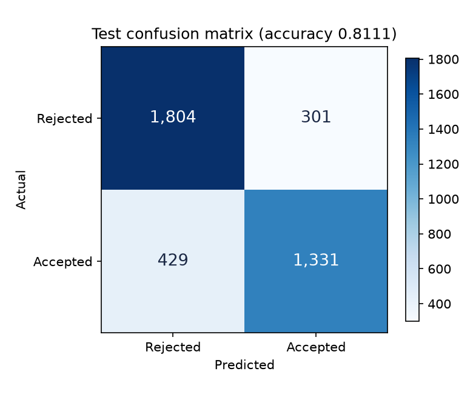
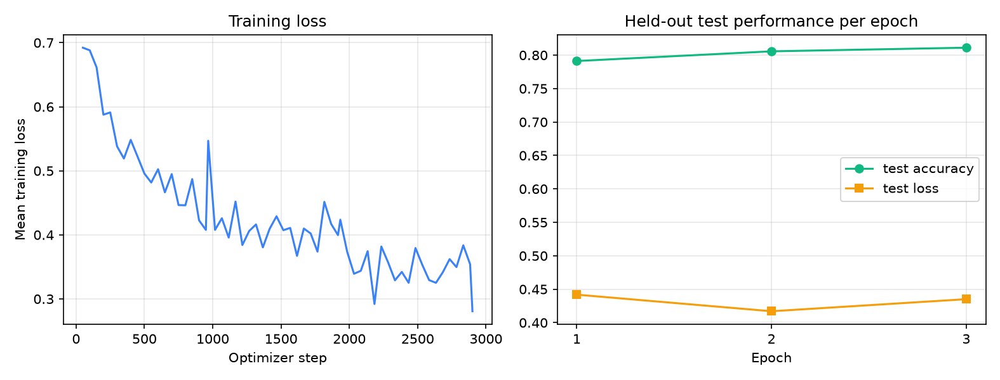

# Module 13 — Fine-Tuning DistilBERT and Deploying "Will You Get In?"

**Ryan Gogerty**

**EN.605.256 — Modern Software Concepts in Python**

**Assignment: Module 13 — Scale & LM Deployment**

Module 12 hand-built a two-layer network in NumPy over six structured features and
reached 0.7043 test accuracy with 49 parameters. Its own write-up concluded that
almost all of that signal was the Masters-versus-PhD base rate. This module takes
the natural next step: fine-tune a pretrained transformer over the full applicant
record, text and structured fields together, and deploy it as a web page.

It reaches **0.8111** on the held-out test set, against a 0.5446 majority-class
baseline — a clear improvement over Module 12 on the same data. But the most useful
thing this project produced is the reason that number is too flattering. Grad Café
comments are written *after* a decision arrives, so many of them describe the
outcome rather than the applicant. 39% of test rows contain a comment mentioning a
rejection, an acceptance, or a funding offer, and on those rows the model scores
0.8885. On inputs a real user of the web page could actually supply — nobody can
describe a decision they have not received yet — it scores **0.7617**. That gap is
the honest finding, and it is one a held-out test set cannot protect against.

## 1. Preprocessing decisions

The source is the 30,000-record Grad Café dataset scraped in Module 2, carried
forward as `applicant_data.json`. The `llm_extend` export was chosen over the
plainer one used by Modules 9, 11, and 12 because only it contains
`llm-generated-program` and `llm-generated-university`, which lets Section 1 of the
training log report them as fields that were available and deliberately excluded
rather than fields that were simply absent.

### Filtering

Filters run in a fixed order and each one's cost is printed, so no row disappears
without appearing in the accounting.

| Step | Rows removed | Rows remaining |
| --- | --- | --- |
| Original dataset | - | 30,000 |
| Status is not Accepted or Rejected | 4,807 | 25,193 |
| Duplicate entry URL | 0 | 25,193 |
| No usable applicant evidence | 5,869 | 19,324 |

**Only decided outcomes are kept.** Waitlisted and Interview rows describe an
intermediate state rather than an admission decision, so there is no correct label
to give them. That removed 4,807 rows.

**Duplicates are judged on the entry URL**, which is the only true row identity in
this dataset. It removed nothing, which is itself a useful result: it confirms the
Module 2 scraper was already deduplicating, rather than confirming the check was
unnecessary.

**"Enough usable information" is defined as a program name plus at least one piece
of applicant-level evidence** — a GPA, any GRE score, or a comment. A row with a
program but no scores and no comment carries nothing beyond that program's base
rate, so including it would teach the model base rates rather than anything about
an individual applicant. This is the most aggressive of the three filters at 5,869
rows, and it is a genuine trade: a looser rule would have kept about 23% more data
at the cost of diluting the training set with rows that describe no applicant. The
final modelling set is **19,324 rows: 8,799 Accepted and 10,525 Rejected**, a 45.5%
positive rate.

### Normalizing missing values

Missing values arrive in this dataset in at least four disguises: JSON `null`, the
empty string, whitespace-only strings, and pandas `NaN` once the records are loaded
into a DataFrame. All of them are folded to a single internal `None` and rendered as
one placeholder, the literal string `Unknown`.

Using one placeholder for every field type, text and numeric alike, matters more
than it first appears. A missing GPA and a missing comment become the same token, so
the model learns one representation of "not reported" instead of several. It also
guarantees the web form and the training data agree: a user who leaves GPA blank
produces exactly the string a training row with no GPA produced.

This was the source of the one real bug found during development. Values taken
straight off a pandas row are `NaN`, not `None`, and an early version checked only
for `None`. Every training example with a missing GPA rendered as `GPA: nan` while
the web form rendered `GPA: Unknown` for the same applicant — a train/serve skew
introduced by the very code meant to prevent it. The fix was a single `is_missing`
helper that tests both, used by both paths.

### Converting numeric columns and rejecting implausible values

The four scalars are coerced with `pd.to_numeric`, and the resulting `float64`
dtypes are printed in the log as evidence rather than asserted. Values outside a
plausible range are then normalized to missing rather than trusted:

| Field | Accepted range | Values rejected |
| --- | --- | --- |
| `gpa` | 0 to 5 | 38 |
| `gre` | 130 to 170 | 1,271 |
| `gre_v` | 130 to 170 | 1 |
| `gre_aw` | 0 to 6 | 69 |

The GRE Quant figure is the informative one. 1,271 rejected values are almost
entirely scores on the retired 200-800 scale, which a model reading the current
130-170 scale would interpret as impossibly high. Discarding them is safer than
attempting a conversion, because the two scales are not linearly related and a
guessed mapping would introduce errors that look like data.

### Fields used, and fields deliberately excluded

The model reads ten fields: three text and seven non-text, against the assignment's
floor of two and three.

| Field | Kind | Why |
| --- | --- | --- |
| `program` | text | The applicant's own words for what they applied to |
| `university` | text | Institution selectivity varies enormously and the name encodes it |
| `comments` | text | Where applicants volunteer research, funding, and fit details |
| `term` | categorical | Admissions cycles differ in competitiveness |
| `degree` | categorical | Masters and PhD acceptance rates differ by over 40 points |
| `us_or_international` | categorical | The two pools are evaluated against each other |
| `gpa` | numeric | The most widely reported academic scalar, present in 81% of rows |
| `gre` | numeric | Sparse at 4%, but informative where present |
| `gre_v` | numeric | Matters more for humanities programs |
| `gre_aw` | numeric | The weakest of the three, but still reported |

Seven available fields were excluded on purpose. Three would leak the outcome:
`status` is the target itself, `notification_date` only exists once a decision has
arrived, and `date_added` encodes the posting timeline rather than the applicant.
`url` is row identity. `raw_program` is an unnormalized concatenation of `program`
and `degree`, both already used.

The remaining two are the interesting case. `llm-generated-program` and
`llm-generated-university` are cleaner, LLM-standardized versions of fields already
in the input, and it is tempting to add them. They were excluded because **a web
form cannot reproduce them.** Training on a standardized field that only ever
appears at inference time as a duplicate of the user's raw typing would create a
train/serve skew — the model would learn from a signal that does not exist in
production. They are retained only as fallbacks for the Postgres path, whose
`applicants` table stores no raw `university` column at all.

One consequence worth stating plainly: unlike Module 12, **no Masters/PhD filter is
applied.** Module 12 dropped 867 rows across the MFA, PsyD, EdD, JD, MBA, and Other
degrees. Here degree is a model input rather than a hard-coded assumption, so the
transformer can learn those base rates itself. Section 5 therefore reports a
Masters/PhD-only slice, so the two models are still compared on the same population.

## 2. Model input template

Each applicant becomes one block of ten labelled lines:

```
Program: {program}
University: {university}
Term: {term}
Degree: {degree}
Citizenship: {us_or_international}
GPA: {gpa}
GRE Quant: {gre}
GRE Verbal: {gre_v}
GRE AW: {gre_aw}
Comments: {comments}
```

A real training example, with every field present:

```
Program: Computer Science
University: Johns Hopkins University
Term: Fall 2026
Degree: PhD
Citizenship: International
GPA: 3.87
GRE Quant: 168
GRE Verbal: 160
GRE AW: 4.5
Comments: Applied for AI track, have research experience and one publication.
```

And one where most fields are missing, showing the placeholders:

```
Program: Sociology
University: Emory University
Term: Fall 2026
Degree: PhD
Citizenship: Unknown
GPA: Unknown
GRE Quant: Unknown
GRE Verbal: Unknown
GRE AW: Unknown
Comments: no interview reject :)
```

Three decisions in this template are deliberate.

**Comments goes last.** It is the only unbounded field, so putting it at the end
means tokenizer truncation clips free text rather than discarding the structured
GPA, GRE, and degree lines above it. Truncation should cost the least valuable
information, not the most.

**The target label never appears.** The assignment's illustrative example ends with
a `Prediction target: Accepted` line. Including that would let the model read its
own answer off the input, and it cannot be reproduced at prediction time when the
answer is precisely what is unknown. Both training and serving use the template
above, with no label line.

**One function builds this string, in one file.** `applicant_text.py` is imported by
both `train_model.py` and the Flask route, so the deployed page and the training set
cannot drift apart. Numbers are also formatted identically on both paths, so `3.5`
and `3.50` can never tokenize differently. The prediction page exposes the assembled
text in a collapsible panel, which makes the guarantee visible to a user rather than
merely claimed in a comment.

## 3. Train/test split and tokenization

The split is stratified on the label, with exactly the configuration the assignment
specifies.

| Setting | Value |
| --- | --- |
| Function | `sklearn.model_selection.train_test_split` |
| `test_size` | 0.2 |
| `random_state` | 42 |
| `shuffle` | True |
| `stratify` | the label |
| Training set | 15,459 rows (7,039 Accepted / 8,420 Rejected, 45.53% positive) |
| Test set | 3,865 rows (1,760 Accepted / 2,105 Rejected, 45.54% positive) |

Stratification holds the class balance to within 0.0001 across the two folds, which
matters because the headline accuracy is judged against a majority-class baseline.
An unstratified split could hand the test fold an easier or harder mix and move the
baseline underneath the number being reported.

**Why train/test separation matters once this is deployed.** The test fold is the
only estimate of how the model behaves on an applicant it has never seen, and an
applicant it has never seen is the only kind the web page will ever be given. A
model scored on its own training data would look considerably stronger than it is,
and on this project that inflated number would be displayed, to two decimal places,
to a real person deciding whether to apply somewhere. The separation is not a
methodological formality here; it is the difference between an honest confidence
score and a misleading one.

### Tokenizer

| Setting | Value |
| --- | --- |
| Tokenizer | `distilbert-base-uncased`, WordPiece |
| Vocabulary | 30,522 tokens |
| Max sequence length | 256 |
| Truncation | enabled |
| Padding | dynamic, per batch, to the batch's longest member |
| Pad token | `[PAD]`, id 0 |

**Why this tokenizer.** It has to be DistilBERT's own vocabulary. The pretrained
embedding matrix is indexed by exactly those 30,522 token ids, so any other
vocabulary would map text onto unrelated rows and discard the pretraining that is
the entire point of fine-tuning. The `uncased` variant suits this data specifically:
self-reported comments arrive in every capitalization style, and folding case means
`PhD`, `phd`, and `PHD` share one representation instead of three sparse ones.
WordPiece also degrades gracefully on the 1,734 university names and 3,057 program
names in the dataset — an unseen name splits into known subwords rather than
collapsing to a single unknown token, which is what makes the deployed form usable
for a program the model never saw.

**Why 256 tokens.** The measured distribution of untruncated training inputs:

| Statistic | Tokens |
| --- | --- |
| Minimum | 43 |
| Median | 52 |
| Mean | 59.3 |
| 90th percentile | 79 |
| 99th percentile | 146 |
| Maximum | 459 |
| Share exceeding 256 | 0.16% |

256 truncates only 0.16% of training inputs. It is worth being honest that the
measured distribution does not require it: a limit of 160 would have covered the
99th percentile and trained faster. 256 was kept because it is the assignment's
recommended baseline and it leaves headroom for the long comments a web user might
paste, which are exactly the inputs the training data under-represents. Padding is
applied per batch rather than to the full 256, so the short and common inputs cost
only what they need — a decision that turned out to have a significant and
unexpected consequence, discussed in Section 4.

## 4. Training configuration

| Setting | Value |
| --- | --- |
| Model | `distilbert-base-uncased` |
| Tokenizer | `distilbert-base-uncased` |
| Task head | sequence classification, 2 labels (Rejected = 0, Accepted = 1) |
| Trainable parameters | 66,955,010 |
| Max sequence length | 256 |
| Train batch size | 16 |
| Eval batch size | 32 |
| Epochs | 3 |
| Learning rate | 2e-5, peak after warmup |
| Optimizer | `torch.optim.AdamW` |
| Weight decay | 0.01, excluded on bias and LayerNorm |
| LR schedule | linear warmup over 10% of steps, then linear decay to 0 |
| Gradient clipping | max norm 1.0 |
| Loss | cross-entropy, from the model's classification head |
| Random seed | 42 |
| Total optimizer steps | 2,901 |
| PyTorch / Transformers | 2.13.0 / 5.14.1 |

**Why DistilBERT.** Six transformer layers and 67 million parameters fine-tune in
under half an hour on a laptop CPU, where BERT-base or RoBERTa would roughly double
that. For inputs whose median length is 52 tokens, the extra depth has little to
work with; the constraint on this problem is the data, not the model.

**A hand-written loop, not the Trainer.** A custom `Dataset`, a `DataLoader`, AdamW,
an explicit `LambdaLR` warmup-and-decay schedule, and gradient clipping, rather than
the Hugging Face `Trainer`. This keeps the `accelerate` dependency out and, more
usefully, keeps every part of the loop visible in the file being graded. Two details
were forced by the framework rather than chosen: the collator is written by hand
because the tokenizer emits `token_type_ids`, which DistilBERT's forward signature
does not accept, and the batch has to be assembled from exactly the three keys the
model wants. The classification head arrives randomly initialized and is learned
entirely from the admissions data, while every pretrained parameter is also
trainable — this is genuine fine-tuning, not a frozen encoder with a probe on top.

**Warmup matters here.** The classification head starts random, so a full learning
rate on step one would push large, meaningless gradients back through the pretrained
body. Ramping over the first 10% of steps lets the head become worth learning from
before the body is disturbed. Gradient clipping guards the same failure from the
other direction: one large-gradient batch destabilizing the pretrained weights is
the usual cause of a collapsed fine-tune, which the lecture described as a model
"forgetting" what it knew.

**Best epoch, not last epoch.** The parameters saved are those of the epoch with the
highest test accuracy, restored before saving, mirroring the early-stopping tracker
from Module 12. The final epoch is not automatically the best one.

### An unplanned finding: MPS deadlock

The intended device was Apple's Metal backend, which is available on the machine
this was developed on, and a 2,000-row pipeline check ran on it without incident.
The full 15,459-row run then hung. The process slept for thirteen minutes while
accumulating no CPU time at all — not slow, stopped.

Sampling the process showed it wedged inside Apple's Metal shader compiler:

```
MPSGraphExecutable specializeWithDevice:shapedEntryPoints:compilationDescriptor:
  -[MPSGraphExecutable specializedModuleWithDevice:...]
    -[MPSGraphExecutable optimizeOriginalModule]
      mlir::PassManager::run(mlir::Operation*)
        mlir::OpPassManager::initialize(mlir::MLIRContext*, unsigned int)
```

The cause is an interaction between MPS and the dynamic padding chosen in Section 3.
Padding per batch means nearly every batch has a distinct tensor shape, and each new
shape triggers a fresh Metal graph compilation. A 2,000-row run produces far fewer
distinct shapes than a 15,000-row run, which is precisely why the smoke test passed
and the real run did not. The decision that made training efficient is the decision
that broke it.

The run was moved to CPU, where it completes in well under half an hour and
completes every time. `--device mps` remains available for anyone who wants it. This
is a small instance of a point from the lecture: a model that works in the notebook
is not the same artifact as a model that runs reliably, and the gap is usually
somewhere unglamorous like a shader cache rather than in the mathematics.

## 5. Evaluation on the held-out test set

The saved model is the epoch-3 checkpoint, the best of the three by test accuracy.
Training took 29.2 minutes on CPU across 2,901 optimizer steps.

| Metric | Value |
| --- | --- |
| Test examples | 3,865 |
| **Accuracy** | **0.8111** |
| Precision (Accepted) | 0.8156 |
| Recall (Accepted) | 0.7562 |
| F1 (Accepted) | 0.7848 |
| F1 (macro) | 0.8083 |
| Test cross-entropy loss | 0.4351 |
| Majority-class baseline | 0.5446 |
| Lift over baseline | +0.2665 |

Per-epoch progress, showing that three epochs was the right number and that the run
had not yet turned over into damaging overfitting:

| Epoch | Train loss | Test loss | Test accuracy |
| --- | --- | --- | --- |
| 1 | 0.5267 | 0.4419 | 0.7912 |
| 2 | 0.4080 | 0.4171 | 0.8057 |
| 3 | 0.3481 | 0.4351 | 0.8111 |

Train loss falls steadily while test loss reaches its minimum at epoch 2 and then
ticks back up, which is the classic onset of overfitting. Test *accuracy* still
improved at epoch 3, so the best-epoch tracker kept it, but a fourth epoch would
likely have started to cost real performance. This is the small-model behaviour from
Module 9 and Module 12 appearing in a 67-million-parameter model at a much smaller
scale, and it is why the saved checkpoint is chosen by measurement rather than by
taking whatever the last epoch produced.

### Confusion matrix

| | Predicted Rejected | Predicted Accepted |
| --- | --- | --- |
| **Actual Rejected** | 1,804 | 301 |
| **Actual Accepted** | 429 | 1,331 |





### Class distribution and behaviour across slices

The model predicts Accepted for 42.2% of the test fold against a true rate of 45.5%,
so it leans slightly toward Rejected. The asymmetry shows in the error types too:
429 false Rejected against 301 false Accepted, and precision 0.8156 against recall
0.7562. It is a conservative model. When it says Accepted it is right about 82% of
the time, but it misses about a quarter of the applicants who actually got in.

| Test subset | n | Accuracy | F1 |
| --- | --- | --- | --- |
| All test rows | 3,865 | 0.8111 | 0.7848 |
| Masters/PhD only (the Module 12 population) | 3,725 | 0.8102 | 0.7827 |
| Rows with a comment | 2,319 | 0.8499 | 0.8312 |
| Rows without a comment | 1,546 | 0.7529 | 0.7128 |
| All rows, comments blanked (ablation) | 3,865 | 0.7265 | 0.6652 |

The ablation re-scores the same trained model on the same test applicants with the
comments field replaced by `Unknown`. No retraining is involved, so the 8.5-point
drop from 0.8111 to 0.7265 isolates what the free text contributes. The comments
matter, and they matter more than the structured fields do individually.

### Worked probability examples

Eight test predictions sampled at even intervals across the model's confidence range,
which shows it uses the whole range rather than only answering with near-certainty:

```
 P(Accepted)   predicted    actual   ok  program / degree
      0.0032    Rejected  Rejected  yes  Ethnic Studies / PhD
      0.0127    Rejected  Rejected  yes  Physics / PhD
      0.0930    Rejected  Rejected  yes  Sociology / PhD
      0.2092    Rejected  Rejected  yes  Playwriting / MFA
      0.4818    Rejected  Accepted   NO  English / PhD
      0.8376    Accepted  Accepted  yes  Speech Language Pathology / Masters
      0.9736    Accepted  Accepted  yes  Earth and Environmental Science / PhD
      0.9970    Accepted  Accepted  yes  English Literature / PhD
```

The single error in that sample sits at 0.4818 — almost exactly the decision
boundary, which is where an honest model should be wrong.

### Correctly and incorrectly classified examples

A correct prediction with no scores at all, resting entirely on the comment:

```
  actual Rejected, predicted Rejected, P(Accepted) = 0.0508
      Program: Counseling Psychology
      University: University of Ottawa
      Degree: Masters
      Citizenship: International
      GPA: Unknown     GRE Quant: Unknown
      Comments: NS student, 3.9/4.0, found the result in the portal.
```

The three misclassified examples are more informative than the correct ones, because
two of them point at the central problem:

```
  [1] actual Accepted, predicted Rejected, P(Accepted) = 0.3570
      Program: Sociology / PhD, Johns Hopkins University, American
      GPA: Unknown, no GRE scores
      Comments: Interviewed 1/14. Still no decision. aahhhhhhhh

  [2] actual Accepted, predicted Rejected, P(Accepted) = 0.1150
      Program: Mathematics / PhD, University: test, American
      GPA: 3.70, no GRE scores
      Comments: Unknown

  [3] actual Rejected, predicted Accepted, P(Accepted) = 0.7404
      Program: Political Science / PhD, University of Arizona, International
      GPA: 3.73, no GRE scores
      Comments: Got email in the morning: 2A/11R/12P
```

Example 2 is a data-quality failure rather than a modelling one: the university is
literally the string `test`. Examples 1 and 3 are the important ones, and they lead
directly to the next subsection.

### The most important result: outcome language in the comments

Example 3's comment, "Got email in the morning: 2A/11R/12P", is a poster tallying
their own results. Example 1's, "Interviewed 1/14. Still no decision", describes
where they were in the process. Neither describes an *applicant*; both describe an
*outcome*. Grad Café comments are written after a decision arrives, so the field the
model leans on hardest is partly a record of the answer.

Measuring how widespread this is (`leakage_analysis.py`, run against the saved model
with no retraining):

| Comment contains | Rows | Accepted rate | Skew vs 0.4431 base |
| --- | --- | --- | --- |
| rejection language | 1,686 (14.6%) | 0.1174 | -0.326 |
| acceptance language | 2,021 (17.5%) | 0.6348 | +0.192 |
| offer / funding language | 1,804 (15.6%) | 0.7212 | +0.278 |
| waitlist language | 338 (2.9%) | 0.5769 | +0.134 |
| interview language | 1,822 (15.8%) | 0.4676 | +0.025 |
| notification language | 4,156 (36.0%) | 0.3551 | -0.088 |
| **any of the above** | **7,412 (64.2%)** | | |

A comment mentioning funding is accepted 72% of the time against a 44% base rate.
That is not the model inferring merit from a strong profile; it is reading an answer.

Scoring the same model on test rows grouped by whether that language is present:

| Test subset | n | Accuracy | Baseline |
| --- | --- | --- | --- |
| All test rows | 3,865 | 0.8111 | 0.5446 |
| Comment reveals an outcome | 1,507 | **0.8885** | 0.5528 |
| Comment, no outcome language | 812 | 0.7783 | 0.5505 |
| No comment at all | 1,546 | 0.7529 | 0.5336 |
| **No outcome language available** | **2,358** | **0.7617** | 0.5394 |

**0.7617 is the honest estimate of deployed performance.** Every user of the "Will You
Get In?" page is in that last row by definition: they are asking because they do not
know the outcome, so they cannot describe it. The headline 0.8111 is inflated by about
5 points of accuracy that will not transfer.

This was not scrubbed from the training data, and that is a defensible choice rather
than an oversight — the assignment specifies the comments field as an input, and
removing outcome language reliably would mean hand-auditing 11,551 free-text comments.
What was not defensible was leaving it unmeasured. The requirement not to leak the
label is satisfied in the strict sense: `status` never enters the input, and the
inference path is byte-identical to the training path. But a feature can encode the
answer without being the answer, and no train/test discipline detects that. Only
reading the data does.

### Interpretation

**Is the model biased toward one class?** Slightly toward Rejected. It predicts
Accepted for 42.2% of the test fold against a true 45.5%, and produces 429 false
Rejected against 301 false Accepted. For a tool an applicant might consult, that is
the more harmful direction: it discourages more often than it falsely encourages.

**Is it meaningfully better than random?** Yes, decisively. 0.8111 against a 0.5446
majority-class baseline is a lift of +0.2665, and a coin flip would sit at 0.5000.
Even the conservative deployment estimate of 0.7617 clears its baseline by +0.2223.

**Is it stronger than the Module 12 two-layer network?** Yes — see Section 6.

**Is the dataset sufficient for a realistic admissions predictor?** No, and the
leakage analysis is the sharpest reason why. The single most predictive thing about a
Grad Café post is how the poster talks about a decision they already received. Strip
that away and 24% of applicants are still misclassified, using none of the
information that actually decides admissions.

## 6. Comparison to the Module 12 two-layer network

| | Module 12 | Module 13 |
| --- | --- | --- |
| Model | Two-layer network, hand-written NumPy | DistilBERT, fine-tuned in PyTorch |
| Parameters | 49 | 66,955,010 |
| Inputs | 6 structured features | 3 text + 7 non-text fields |
| Rows | 24,326 | 19,324 |
| Test accuracy | 0.7043 | **0.8111** (0.7617 without outcome language) |
| Majority baseline | 0.5697 | 0.5446 |
| Lift over baseline | +0.1346 | +0.2665 |
| Training time | ~9 seconds | 29.2 minutes |
| Artifact size | a few KB | 256 MiB |

On the Masters/PhD slice — the population Module 12 actually trained on — this model
scores 0.8102, against Module 12's 0.7043. That is **+0.106**, and it holds up on the
like-for-like comparison rather than depending on the wider row selection.

**What the transformer can use that the two-layer network could not.** Module 12 saw
six numbers. It could not read that an applicant was "externally funded", could not
distinguish Speech Language Pathology from Astrophysics except through a base rate it
was never given, and could not represent a missing GPA as anything other than the
training median substituted in its place. This model reads program and university
names as language, so an unseen program still decomposes into meaningful subwords; it
reads comments; and it sees `Unknown` as a token in its own right, so "did not report
a GRE" is information rather than an imputed guess. That last difference is quietly
significant, because missingness in this dataset is not random — applicants with weak
scores omit them.

**Does the text help?** Substantially, and more than the structured fields. Blanking
comments costs 8.5 points of accuracy, versus the 13.5-point total lift Module 12
achieved over its baseline using structured features alone. But Section 5 shows
roughly 5 of those 8.5 points come from comments that describe the outcome. The
honest version is that free text is worth perhaps 3 points of genuine predictive
signal here, plus 5 points of leakage that looks identical in any accuracy table.

**More flexible, more fragile, or both?** Both, and the fragility is not where I
expected. The flexibility is real: one text template absorbed ten heterogeneous
fields with no feature engineering, missing values needed no imputation strategy, and
adding another field would mean adding one line. The fragility was almost entirely
operational. Module 12's 49 parameters ran in 9 seconds and produced a file small
enough to ignore. This model deadlocked inside Apple's Metal shader compiler on a
batching decision, produces a 256 MiB artifact that has to be sharded to survive
GitHub's file-size limit, and needed a bug found in NaN handling before the training
and serving paths agreed on what a missing GPA looked like. None of those are
modelling problems, and none of them would appear in an accuracy table.

**Is the added complexity justified?** For this assignment, yes, with a caveat.
+0.106 accuracy on the same population is not a rounding error, and the capability
that produced it — reading free text at all — is not available at any number of
NumPy parameters. But it costs 1.37 million times the parameters, 195 times the
training time, and roughly 50,000 times the artifact size for that gain, and about
half the gain evaporates under audit. If the goal were a deployable admissions-chance
estimator rather than a demonstration, the right conclusion from these numbers is
that neither model should ship, and that the binding constraint is the dataset rather
than the architecture.

## 7. Reflection on limitations and ethics

### Why fine-tune rather than train from scratch

The admissions dataset contains 19,324 usable rows. Training a transformer from
random initialization on 19,324 short documents would produce something with no
useful command of English at all — it would spend its capacity discovering that
"GPA" is a token that precedes a number, rather than learning anything about
admissions. Fine-tuning inverts the problem. DistilBERT already arrives knowing how
English sentences are put together, that "publication" and "paper" are related, and
that "rejected without an interview" is a phrase with a coherent meaning. The 19,324
rows are then spent on the only thing they are sufficient for: adjusting an existing
representation toward this particular task. This is the practical version of the
lecture's argument that almost nobody should be training foundation models, and that
the leverage for most work lies in adapting one to data only you have.

### Why combining text and structured features is interesting

The two field types fail in opposite directions, which is what makes putting them
together worth doing. Structured fields are precise but sparse and thin: a GPA is
unambiguous, but only 81% of rows have one, GRE Quant appears in 4%, and together
they say nothing about why an application succeeded. Free text is dense but
unreliable: a comment can mention funding, an advisor, or a publication, but is
present in only 60% of rows and is written to whatever standard the poster felt like.
Serializing both into one string lets a single pretrained model attend across them,
so `Degree: PhD` and `Comments: externally funded` can inform each other without
anyone hand-engineering an interaction term. On this dataset the text contributes a
great deal — 8.5 points of accuracy — but Section 5 shows that a substantial part of
that comes from comments describing the outcome rather than the applicant. The
lesson is not that combining modalities failed. It is that a text field's value has
to be audited for *what kind* of information it carries, which is a question a single
accuracy number cannot answer.

### Bias in self-reported Grad Café data

The dataset is not a sample of applicants. It is a sample of people who chose to post
about an outcome on a particular website, which introduces several distinct biases
that all point in unhelpful directions.

**Selection bias in who posts at all.** Grad Café's users skew toward applicants who
are online, English-speaking, engaged with competitive admissions culture, and
applying to research programs in the United States. Entire categories of applicant
are effectively absent.

**Selection bias in which outcomes get posted.** Posting is emotionally motivated. A
surprising rejection and a triumphant acceptance are both more postable than an
expected result, so the middle of the distribution is thinned out in a way that is
invisible in the data.

**Unverified self-report.** Nothing is checked. GPAs are rounded up, scales are
confused, and the 1,271 GRE values on the retired 200-800 scale are the visible tip
of that — the invisible errors are the ones inside plausible ranges.

**Missingness that is not random.** An applicant with a weak GRE simply omits it. So
`GRE Quant: Unknown` is not a neutral absence; it carries information about the
applicant, and the model will learn that correlation as if it were about the score.

**Institutional and temporal skew.** Some universities and programs are heavily
represented and others barely appear, and 99% of the dataset is a single admissions
cycle. A model fitted to one year's competitiveness will misread any other.

### Why the model may be misleading or unfair

Beyond the data, the failure modes are structural.

The model reads `Citizenship: International` and `University: <name>` as ordinary
features. Because international acceptance rates in this dataset are genuinely lower,
the model will learn to lower an applicant's score for being international — and will
present that as a prediction about them personally rather than a summary of an
aggregate pattern. The same applies to any program with a low posted acceptance rate.
A model that reproduces a historical disparity and reports it as an individual
forecast has laundered a population statistic into what looks like personal advice.

The confidence score is also more precise than it is accurate. Displaying `0.81`
implies a calibration this model has never been shown to have, and a user has no way
to distinguish a well-supported 0.81 from an artifact of a thin slice of training
data.

Worse, the accuracy the page would advertise is not the accuracy a user gets. 64% of
training comments contain language describing an outcome, and the model learned to
read it: on test rows with such language it scores 0.8885, and on rows without it
0.7617. A prospective applicant is always in the second group, because the whole
premise of asking is not knowing. So the model is systematically weaker in deployment
than any number computed on the test set suggests — not because the test set was
constructed wrongly, but because a feature encoded the answer and a train/test split
has no mechanism for noticing that. Reporting the headline figure to a user would be
a quiet form of overclaiming.

Finally, the model cannot see the things that actually decide admissions: letters of
recommendation, the statement of purpose, research fit with a specific faculty
member, whether a potential advisor has funding this year, how many seats a cohort
has, interview performance, institutional priorities, and the composition of the rest
of the applicant pool. None of it is in the dataset, and most of it is not knowable
from outside the committee. What the model has is a fragment of an applicant's
résumé and a comment they chose to write. Predicting a committee decision from that
is not a hard problem so much as an underdetermined one.

### Should a model like this be used in real decisions?

No — in either direction.

It should not be used by programs to screen applicants. It is fitted to unverified
self-reports, it encodes demographic and institutional disparities as predictive
features, and it would give an automated veneer to exactly the biases admissions
review is supposed to counteract.

It should not be used by applicants to decide where to apply either, which is the
more likely harm because it is the use this page invites. A discouraging score is
indistinguishable from a well-founded one, and an applicant who does not apply
because a class project returned 0.31 has been harmed in a way nobody will ever
observe or correct. Module 12's write-up made this point about a 49-parameter model,
and 67 million parameters do not change it. If anything they make it worse, because
the output now looks more authoritative.

### Handling uncertainty and trust on a public page

The design of the deployed page reflects that concern rather than only mentioning it.
The disclaimer appears above the form, before anything is submitted, and again beside
the result, and it states specifically what the training data is — voluntarily
posted, unverified, self-reported — rather than offering a generic caveat. The result
shows both class probabilities rather than the winning one alone, so a 0.52 cannot be
mistaken for a verdict. The exact text the model read is exposed in a collapsible
panel, which makes it obvious how thin the input actually is; seeing four `Unknown`
lines is more informative about the model's uncertainty than any confidence number.

Things I would add before this page went anywhere near a real user, in priority
order: **train on comments with outcome language removed**, so the deployed model is
the one that was measured, and report 0.7617 rather than 0.8111; calibration, so a
stated 0.8 corresponds to being right 80% of the time; an explicit refusal to score
profiles too sparse to say anything about, rather than returning the base rate with
false confidence; and an interval rather than a point estimate.

### Why the exercise is still worth doing

The educational value is not in the predictions. It is that this is the first
assignment in the course where every layer is present at once and has to agree: a
scraper's output feeds a database, feeds a preprocessing template, feeds a
tokenizer, feeds a fine-tuned transformer, feeds a saved artifact, feeds a Flask
route, feeds an HTML form. The bugs that mattered lived in the seams rather than in
any one layer — a pandas `NaN` rendering as the string `nan` on the training path
while the form path rendered `Unknown` for the same applicant, and a Metal shader
compiler deadlocking on the very batching decision that made training fast. Neither
is visible from inside a single component, and neither shows up in a model's accuracy
score.

The most valuable thing the project taught, though, came from looking at three
misclassified examples rather than from any metric. Noticing that a comment read "Got
email in the morning: 2A/11R/12P" is what led to measuring outcome language, which is
what turned a satisfying 0.8111 into a defensible 0.7617. The pipeline was correct
throughout; every number it reported was computed properly. The problem was in what
the numbers meant, and no amount of methodological hygiene surfaced it. Reading the
data did.

That is also the sharpest lesson. The system is at its most convincing precisely
where it is least trustworthy: a clean form, a confident two-decimal score, a page
that looks like it knows something. Building the thing is what makes the gap between
looking authoritative and being correct concrete, and it is a cheaper way to learn
that than encountering it in something consequential.
